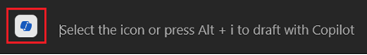

---
demo:
  title: 'Demo: Copilot in Word'
---

[Torna all'indice](https://microsoftlearning.github.io/MS-4012-Microsoft-Copilot-Web-Based-Interactive-Experience-for-Executives/)

# Microsoft 365 Copilot in Word

## Configurazione della demo

I documenti di esempio sono disponibili nel repository GitHub MS-4012 [qui](https://github.com/MicrosoftLearning/MS-4012-Microsoft-Copilot-Unlocked/tree/master/Resourcefiles).

I file specifici usati in questo esercizio sono:

- [**ContosoLearn App Overview.docx**](https://github.com/MicrosoftLearning/MS-4012-Microsoft-Copilot-Unlocked/raw/master/Resourcefiles/ContosoLearn%20App%20Overview.docx)
- [**ContosoLearn Competitor SWOT.docx**](https://github.com/MicrosoftLearning/MS-4012-Microsoft-Copilot-Unlocked/raw/master/Resourcefiles/ContosoLearn%20Competitor%20SWOT.docx)
- [**ContosoLearn Value Proposition.docx**](https://github.com/MicrosoftLearning/MS-4012-Microsoft-Copilot-Unlocked/raw/master/Resourcefiles/ContosoLearn%20Value%20Proposition.docx)
- (Facoltativo: vedere le istruzioni seguenti) [**Conferenza telefonica sugli utili del secondo trimestre dell'anno fiscale 2024 di Microsoft**](https://github.com/MicrosoftLearning/MS-4012-Microsoft-Copilot-Unlocked/raw/master/Resourcefiles/Microsoft_FY24_Second_Quarter_Earnings_Conference_Call.docx) 

> **NOTA:** la sincronizzazione di questi file con OneDrive può richiedere fino a 10 minuti. Per accelerare questo processo, è possibile aprire il documento e successivamente chiuderlo, aggiungendolo in questo modo all'elenco degli elementi usati di recente .

## Punti di discussione

Nell'esperienza interattiva abbiamo immaginato nuove idee di app o servizi, creato asset di identità e marketing del marchio e analizzato il panorama competitivo. Ma come possiamo fare ulteriori progressi?

Con Copilot in Word è possibile trasformare il processo di creazione e perfezionamento dei documenti, consentendo di produrre contenuti accattivanti con facilità.

In questa demo verranno presi i documenti appena creati e trasformati insieme per creare un report di analisi strategica. Inoltre, verrà modificato il formato e il tono per garantire che il contenuto sia perfettamente in linea con gli obiettivi perseguiti.

## Passaggi della demo

1. Avviare Microsoft Word sul desktop o digitando **Word.new** in una nuova scheda di Edge.
1. Fare clic nel corpo del documento e selezionare **l'icona di Copilot** visualizzata.

    

1. In Word dovrebbe essere visualizzata la finestra **Bozza con Copilot**. Nel campo della richiesta immettere la richiesta seguente:

    ```text
    Create a comprehensive strategic analysis report for ContosoLearn using the following files as references: /ContosoLearn App Overview, /ContosoLearn Competitor SWOT, and /ContosoLearn Value Proposition. The strategic analysis report should include the following sections:
        
    Executive Summary
    App Overview
    Market Research
    Competitor SWOT Analysis
    Value Proposition
    Conclusion
    ```

    > **IMPORTANTE:** sarà necessario digitare nuovamente "/" e selezionare i file corretti dall'elenco degli elementi usati di recente per il corretto funzionamento di questa opzione.

1. Copilot genererà ora una bozza della relazione di analisi strategica in base alla richiesta fornita. Quando Copilot ha terminato l'operazione, viene visualizzata la finestra di richiesta seguente:

    
    
    Nel campo della richiesta immettere quanto segue:

    ```text
    Remove the "Market Research" section and add a "Competitive Landscape" section. Ensure the content is concise and aligns with the overall tone of the document.
    ```

    > **NOTA:** se Copilot per Word non collabora con l'utente, è possibile usare il collegamento seguente per accedere al documento generato: [**ContosoLearn Example Word Output**](https://github.com/MicrosoftLearning/MS-4012-Microsoft-Copilot-Unlocked/raw/master/Resourcefiles/ContosoLearn%20Example%20Word%20Output%20(not%20to%20be%20used).docx).

## Passaggi facoltativi della demo

### Riassumere un documento di grandi dimensioni

1. Scaricare e aprire il file seguente in Word sul desktop: [**Conferenza telefonica sugli utili del secondo trimestre dell'anno fiscale 2024 di Microsof**](https://github.com/MicrosoftLearning/MS-4012-Microsoft-Copilot-Unlocked/raw/master/Resourcefiles/Microsoft_FY24_Second_Quarter_Earnings_Conference_Call.docx).
1. Nella barra multifunzione di Word selezionare **l'icona di Copilot**.

    

1. Nel campo **Chiedimi qualcosa su questo documento**, copiare e incollare la richiesta oppure digitare: 

    ```text
    Based on the document, how did AI impact Microsoft's earnings this year?
    ```

1. Selezionare **Invia**.  
1. Nel campo **Chiedimi qualcosa su questo documento**, copiare e incollare la richiesta oppure digitare: 

    ```text
    Copilot, generate a FAQ based on this document.
    ```
    
1. Selezionare **Invia**.

[Torna all'indice](https://microsoftlearning.github.io/MS-4012-Microsoft-Copilot-Web-Based-Interactive-Experience-for-Executives/)
