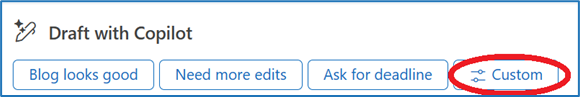

---
demo:
  title: 'Demo: Copilot in Outlook'
---

[Torna all'indice](https://microsoftlearning.github.io/MS-4012-Microsoft-Copilot-Web-Based-Interactive-Experience-for-Executives/)

# Microsoft 365 Copilot in Outlook

## Configurazione della demo

Le istruzioni di configurazione della demo per questa opzione sono disponibili [qui](https://microsoft.seismic.com/Link/Content/DCFPQWmT2DMXC8WJjgjP4H44GWXG). In particolare, alle pagine 1-4, che illustrano come configurare il thread di posta elettronica a cui si farà riferimento nella demo seguente.

> **IMPORTANTE:** la configurazione della demo richiederà almeno 4 persone (facoltativamente 6). Eseguire questa operazione insieme al proprio team prima della consegna pianificata. Al termine, è possibile fare riferimento a questo messaggio di posta elettronica per le consegne future.

## Punti di discussione

"Si prenda ad esempio un thread di posta elettronica. Potrebbe essere una discussione fittizia in cui il team discute di un post di blog importante su Copilot. Può avere un aspetto molto simile ai thread di posta elettronica che si vedono quotidianamente.

Selezionando il pulsante Riepilogo per Copilot, Copilot riepiloga il thread e indica i punti più rilevanti.

È una funazione molto utile. Nella casella di posta elettronica arrivano continuamente lunghi thread di messaggi e può essere difficile distinguere tra ciò che è importante e ciò che non lo è.

Per rispondere può essere utile farsi aiutare da Copilot. Si può notare che Copilot ha generato alcune richieste suggerite perché ha letto il thread di posta elettronica e ha una conoscenza del contesto e di come si potrebbe voler rispondere.

Ciò è utile, ma questa risposta richiede una formulazione personalizzata. La richiesta può anche essere modificata per personalizzare il tono e la lunghezza della risposta.

Selezionando l'opzione per usare un tono personale, Copilot esamina la posta elettronica in uscita e assicura che la risposta corrisponda allo stile di comunicazione personale. Proviamo a usare questa opzione.

Il risultato è abbastanza buono, ma potrebbe essere migliore. I risultati di Copilot sono basati, in parte, sulla qualità della domanda posta.

D'accordo, teniamo questa risposta".

## Passaggi della demo

1. Passare a Outlook con la demo del thread di posta elettronica aperta.

    > **IMPORTANTE:** non mostrare messaggi di posta elettronica contenenti dati riservati.

1. Sotto l'oggetto del messaggio di posta elettronica selezionare **Riepilogo per Copilot** e indicare i risultati.
1. Selezionare **Rispondi a tutti** nella parte superiore della pagina.
1. Nella parte inferiore del campo del nuovo messaggio, indicare la sezione **Bozza con Copilot** e le richieste suggerite.
1. Seleziona **Personalizza**.

    


1. Nel campo **Cosa vuoi che venga detto in questo messaggio di posta elettronica**, copiare e incollare la richiesta o digitare: 

    ```text
    Approve and thank the team--be warm! They worked hard. And be a little funny if you can.
    ```

1. Selezionare il pulsante **Modifica richiesta**.

    

1. Selezionare **Tono personale**.
1. Selezionare **Genera**.
1. Selezionare la casella di testo **Si desidera modificare qualcosa?** qualcosa?
1. Copiare e incollare la richiesta o digitare: 

    ```text
    Can you make a that a bit longer? It's just a little bit too short.
    ```

1. Selezionare il pulsante **Genera**.  
1. **Facoltativo**: nella casella di testo **Si desidera modificare qualcosa?** digitare **"Rendi più divertente"**, quindi selezionare Genera.
1. Selezionare **Mantieni**.

    > **NOTA:** non inviare la risposta, perché questo thread di posta elettronica potrà essere usato per demo future.

[Torna all'indice](https://microsoftlearning.github.io/MS-4012-Microsoft-Copilot-Web-Based-Interactive-Experience-for-Executives/)
