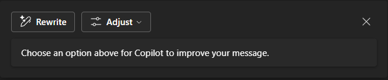

---
demo:
  title: 'Demo: Copilot in Teams'
---

[Torna all'indice](https://microsoftlearning.github.io/MS-4012-Microsoft-Copilot-Web-Based-Interactive-Experience-for-Executives/)

# Microsoft 365 Copilot in Teams

## Configurazione della demo

Per assicurare una demo uniforme, scegliere una delle opzioni di configurazione seguenti:

**Opzione A: riepilogo di una riunione**

Le istruzioni di configurazione della demo per questa opzione sono disponibili [qui](https://microsoft.seismic.com/Link/Content/DCFPQWmT2DMXC8WJjgjP4H44GWXG). In particolare, consultare le pagine da 5 a 10 che illustrano come configurare la riunione di Teams (progetto Avalon) a cui verrà fatto riferimento nella demo seguente.

> **IMPORTANTE:**
> - La configurazione dell'opzione A della demo richiede almeno 4 persone (facoltativamente 6).
> - Eseguire questa operazione insieme al proprio team prima della consegna pianificata.
> - Al termine, è possibile fare riferimento a questa riunione di Teams per le consegne future.
> - Se non è possibile eseguire il lavoro di preparazione per un motivo qualunque, fare riferimento all'opzione B della demo.

**Opzione B: chat di Teams**

Questa opzione della demo non prevede intenzionalmente alcuna configurazione preliminare. Tuttavia, sarà necessario basarsi su uno dei thread di chat di Teams preesistenti. Prima di usarla per la demo, assicurarsi che nella chat non siano state condivise informazioni riservate.


## Opzione A - Demo di riepilogo della riunione

### Punti di discussione

"Ora verrà illustrato ciò che viene denominato il riepilogo di una riunione in Teams.

Di seguito viene riprodotta una riunione tra colleghi. Non è possibile mostrare la riunione reale per motivi di riservatezza, ma viene proposta una riunione fittizia registrata con il team in cui si discute dell'avvio di un prodotto fittizio denominato progetto Avalon.

Il riepilogo è basato sulla trascrizione della registrazione e mostra le persone coinvolte e i momenti in cui hanno parlato. È incluso anche un riepilogo dei temi trattati. Copilot ha organizzato la riunione in sezioni per facilitare la ricerca degli argomenti desiderati.

A questo punto è possibile porre domande a Copilot e ottenere altre informazioni sulla riunione. Ad esempio, si può vedere cosa è stato discusso e le azioni di ogni persona".

### Passaggi della demo

1. Passare alla scheda del browser con Microsoft Teams aperto nella **riunione di avvio del progetto Avalon**.

    > **IMPORTANTE:** non mostrare riunioni o chat contenenti dati riservati.

1. Selezionare la scheda **Riepilogo**.

    

1. Indicare gli **altoparlanti**.
1. Selezionare **Argomenti**.

    

1. Selezionare **Capitoli**.

    

1. Nell'angolo superiore destro selezionare **Copilot**.

    

1. Nella casella di testo **Chiedimi qualcosa su questa riunione** copiare e incollare la richiesta:

    ```text
    Can you list action items and owners in a table?
    ```

1. Selezionare **Invia**.
1. Nella casella di testo **Chiedimi qualcosa su questa riunione** copiare e incollare la richiesta: 

    ```text
    Did anyone strongly oppose the decision, and how do you know?
    ```
    
1. Selezionare **Invia**.
1. Nella casella di testo **Chiedimi qualcosa su questa riunione** copiare e incollare la richiesta:

    ```text
    Based on the transcript, when would you recommend we launch the product and why?
    ```

1. Selezionare **Invia**.

## Opzione B - Chat di Teams

### Punti di discussione

"Verrà mostrato ora in che modo Copilot può migliorare l'esperienza di Chat di Teams.

Viene riprodotto il thread di una chat tra colleghi. Copilot aiuta a riepilogare i punti salienti della chat, facilitando il recupero dei punti importanti senza necessità di leggere ogni messaggio.

Ora è possibile porre domande a Copilot per ottenere informazioni più specifiche dalla chat. Ad esempio, è possibile individuare gli elementi aperti e stabilire come procedere con i passaggi successivi.

Inoltre, è possibile elaborare una risposta e usare Copilot per perfezionarla, assicurando che il messaggio sia chiaro e conciso. Ciò è particolarmente utile per garantire una comunicazione efficace all'interno del team."

### Passaggi della demo

1. Trovare il thread di una chat di Teams in cui non sono state condivise informazioni riservate. Selezionare l'opzione **Apri chat in una nuova finestra**.

    

1. Dopo aver aperto la chat di Teams in una nuova finestra, selezionare **Apri Copilot** nell'angolo in alto a destra.

    

1. Nel riquadro della chat di Copilot visualizzato selezionare **Highlights dell'ultimo giorno*** per un breve riepilogo delle chat dell'ultimo giorno.

    

1. Nella casella di testo **Poni una domanda su questa chat** copiare e incollare la richiesta: 

    ```text
    What are the open items?
    ```
    > **Nota:** è possibile scegliere un esempio di richiesta alternativa che si ritiene sia più mirata ai destinatari.   

1. Nella casella di testo **Digita un messaggio** nella cronologia della chat, iniziare a digitare una risposta. **Aspettare a premere Invio.**

1. Con la bozza di risposta, selezionare Copilot dalla casella di testo **Digita un messaggio**.

       

1. Fare alcune prove con le opzioni **Riscrivi** e **Modifica** di Copilot per dimostrare altre funzionalità di Copilot.

         

[Torna all'indice](https://microsoftlearning.github.io/MS-4012-Microsoft-Copilot-Web-Based-Interactive-Experience-for-Executives/)
