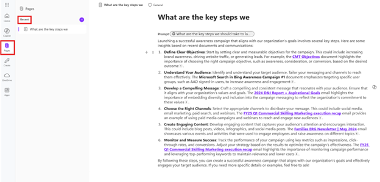
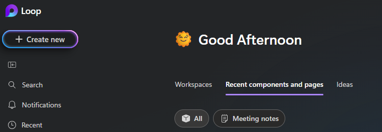
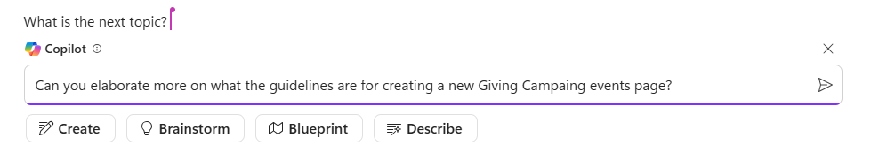

---
demo:
  title: 'Demo: Business Chat e Pages'
---

[Torna all'indice](https://microsoftlearning.github.io/MS-4012-Microsoft-Copilot-Web-Based-Interactive-Experience-for-Executives/)

# Demo di BizChat (per dispositivi mobili e PC)

## Passaggi della demo di BizChat per dispositivi mobili

1. Avviare Copilot sul proprio dispositivo mobile.

1. Verificare che sia selezionata la **Scheda lavoro**.

1. Digitare o dettare la seguente richiesta:

   ```text
   can you find me any emails from earlier today from my colleague [colleagues name] and list up any action items
   ```
1. Un altro esempio che è possibile usare:

   ```text
   summarize the info you have on <Customer XYZ> in my calendar for this week
   ```

## Passaggi della demo dell'app BizChat in Microsoft 365

1. Avviare BizChat passando a [m365.cloud.microsoft/chat](https://m365.cloud.microsoft/chat).

1. Con BizChat aperta, verificare che sia selezionata la Scheda lavoro.

    

1. Digitare la richiesta seguente:

    ```text
    What are the key steps we should take to launch a successful Giving Campaign within our company?
    ```

1. Quindi, esportare la risposta in **Pages** selezionando **Modifica in Pages**:

    

1. Successivamente, è possibile impostare le etichette di riservatezza della presentazione all'interno della pagina:

    

1. È ora possibile visualizzare dove sono accessibili le pagine. Sono disponibili due opzioni:

    - accesso dall'app Pages (sincronizzata automaticamente):

        

    - accesso da Loop, in **Componenti e idee recenti**:

        

1. Tornare alla scheda Pagine aperta in cui è ancora visualizzata la pagina (https://m365.cloud.microsoft/pages).

1. Continuare a usare la pagina digitando la richiesta seguente:

     ```text
     Can you elaborate more on what the guidelines are for creating a new Giving Campaing events page?
     ```

     

1. In fondo alla pagina, digitare il simbolo @ (**@**). Verrà aperto un menu di scelta rapida per cercare persone, file, riunioni e altro ancora:

1. Aggiungere uno dei colleghi dall'elenco di persone.

1. Dopo aver aggiunto il collega, fare clic sul suo nome per concedergli l'accesso. Questi riceverà una notifica tramite posta elettronica con un collegamento per collaborare alla pagina:

    

1. Una volta che il collega ha l'accesso, può continuare a lavorare sulla pagina tramite Outlook, Pages o Loop. 


[Torna all'indice](https://microsoftlearning.github.io/MS-4012-Microsoft-Copilot-Web-Based-Interactive-Experience-for-Executives/)
